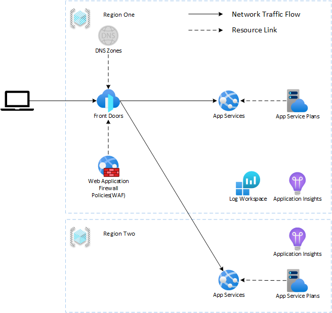

# POC - Azure Front Door + WAF + App Services + Multi-region

This repository contains a proof of concept for a multi-region deployment of an .NET 7 Web Application using Azure Front Door, Azure Web Application Firewall and Azure App Services.

This is not a full production ready solution, but it can be used as a starting point for your own solution.

---

## Architecture

* DNS Zone is an external resource referenced in this solution.
* Front Door and the WAF Policy are Global services; their metadata is deployed to the primary regions resource group.
* Log Analytics Workspace is a regional service; to allow consolidation of logs both regions use it.
* Not shown; all the resources have diagnostic logging configured to the primary regions Log Analytics Workspace.
* Not shown; the deployed app services are configured against the app insights in their respective regions which are backed by the Log Analytics Workspace in the primary region.
* App Services have been restricted to only allow traffic from Front Door using service tag and header-check.
* The WAF is deployed in detection mode, so no traffic is blocked. This is to support the [WAF Scenario](/docs/scenario-waf.md).

---

## Further Considerations

Naturally, this is a limited architecture for the POC with many additional considerations required. Here are a few as a starting point:

* Traffic is split evenly between the regions, no scaling or failover is configured. This is a simple POC, but in a production environment you would want to consider how to scale and failover traffic.

* The GitHub Actions workflow contains no validation or testing steps.

---

## POC Scenarios

* [WAF Scenario](/docs/scenario-waf.md) - After deploying the solution this scenario will show how to configure the WAF to block traffic.
