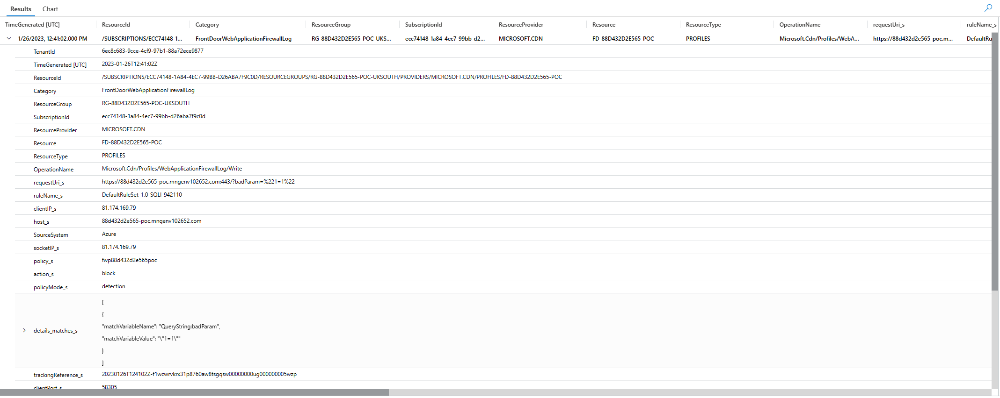

# WAF Scenario

This scenario will show how to configure the WAF to block traffic. The WAF is deployed in detection mode, so no traffic is blocked, once the solution is deployed then we can run through some requests to trigger the WAF rules and then query log analytics to see the results.

This scenario will allow a worked example of the process described here: <https://learn.microsoft.com/en-us/azure/web-application-firewall/afds/waf-front-door-tuning?pivots=front-door-standard-premium>

---

## Triggering Detections

Executing the requests in [](./../requests/block-requests.http) will trigger the WAF rules and generate detections in the Log Analytics Workspace.

These can be queried through:

```kusto
AzureDiagnostics
| where Category == 'FrontDoorWebApplicationFirewallLog'
| where action_s == 'Block'
| where policyMode_s == 'detection'
| order by TimeGenerated desc
```

An example of the results is shown below:



---
